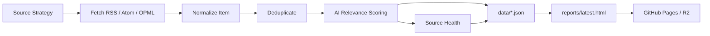

# AI News Radar 重构说明

> 分支：`refactor/ai-news-radar-architecture`  
> 目标：把原本偏“热榜推送”的 TrendRadar fork，重构为一个更适合长期跟踪 AI 生态的高信号新闻雷达。

---

## 1. 目标函数

把每天分散在官方博客、changelog、GitHub Atom、公开聚合源、个人 OPML 与 Newsletter 里的 AI 更新，压缩为一个：

- **可解释**：每条内容为什么被保留，有 relevance score 与命中原因；
- **可控**：信源、权重、窗口、阈值都在配置文件里；
- **可观测**：每个信源有健康状态、抓取数量、保留数量、错误原因；
- **可反馈**：人工看完后可以调源、调权重、调关键词；
- **可发布**：输出静态 JSON 与 HTML，不需要服务器。

---

## 2. 系统边界

### 当前 MVP 做什么

| 模块 | 当前实现 | 文件 |
|---|---|---|
| 信源策略 | 按类型、权重、分组管理信源 | `config/source_strategy.yaml` |
| 抓取 | RSS / Atom / OPML RSS | `scripts/ai_news_radar.py` |
| 归一化 | 标题、URL、摘要、发布时间 | `scripts/ai_news_radar.py` |
| 去重 | URL 优先，标题兜底 | `scripts/ai_news_radar.py` |
| AI 相关过滤 | 关键词打分，不消耗模型额度 | `scripts/ai_news_radar.py` |
| 信源健康 | 成功/失败、抓取量、保留量、延迟 | `data/ai-news-radar.json` |
| 静态页面 | 高信号条目 + 健康表 | `reports/latest.html` |
| 自动化 | GitHub Actions 定时运行 | `.github/workflows/ai-news-radar.yml` |

### 当前 MVP 暂不做什么

| 暂不做 | 原因 | 后续路径 |
|---|---|---|
| X API 抓取 | 成本、额度、token 管理复杂 | 作为高级源，按预算开关接入 |
| 登录态网页/cookie 抓取 | 风险高、稳定性差 | 默认跳过 |
| 私有邮件原文发布 | 隐私风险 | 只做脱敏摘要，默认不提交 |
| LLM 逐条总结 | 会消耗额度，先跑通无模型版本 | 后续增加可选 `AI_SUMMARY_ENABLED` |
| 完全替换旧 TrendRadar | 旧流程仍有多渠道推送价值 | 先并行，后迁移 |

---

## 3. 核心逻辑



---

## 4. 决策逻辑

### 信源准入

| 类型 | 准入标准 | 默认动作 |
|---|---|---|
| `official_rss` | 官方博客、官方 changelog、GitHub Atom | 直接进入主榜，高权重 |
| `opml_rss` | 个人订阅源，可批量导入 | 先观察，必要时单独分组 |
| `public_feed` | 聚合站、公开 JSON/feed | 降权、严格去重 |
| `static_page` | 无 feed 的公开页面 | 暂不默认抓取，后续用 Jina 兜底 |
| `private_mail` | Newsletter / AgentMail | 默认不开；只发布脱敏摘要 |
| `skip` | 登录态、cookie、高噪音或版权风险 | 跳过 |

### 条目保留

当前规则：

```text
is_ai_related = relevance_score >= min_relevance_score
```

得分来源：

- strong keyword：+2
- weak keyword：+1
- source include keyword：+2
- 官方 AI 源先验：+1
- 公开聚合源噪音惩罚：-1

---

## 5. 可控变量

| 变量 | 位置 | 调整目的 |
|---|---|---|
| `window_hours` | `config/source_strategy.yaml` / workflow input | 控制最近多少小时 |
| `min_relevance_score` | `config/source_strategy.yaml` / workflow input | 控制筛选严格程度 |
| `sources[].enabled` | `config/source_strategy.yaml` | 开关信源 |
| `sources[].weight` | `config/source_strategy.yaml` | 调整信源优先级 |
| `sources[].include_keywords` | `config/source_strategy.yaml` | 给特定信源加白名单关键词 |
| `relevance.strong_keywords` | `config/source_strategy.yaml` | 增加高意图 AI 词 |
| `relevance.weak_keywords` | `config/source_strategy.yaml` | 增加辅助识别词 |
| `FOLLOW_OPML_B64` | GitHub Secrets | 私有 OPML 接入 |

---

## 6. 反馈指标

| 指标 | 看哪里 | 理想状态 | 纠偏动作 |
|---|---|---|---|
| `item_count` | `data/ai-news-radar.json` | 每次 10–60 条 | 太多就提高阈值；太少就降阈值/加源 |
| `healthy_source_count` | `data/ai-news-radar.json` | 接近全部健康 | 连续失败的源降级或移除 |
| `source_health[].kept_count` | `data/ai-news-radar.json` | 官方源稳定产出 | 高抓取低保留说明噪音大 |
| false positive | 人工阅读 | 低于 15% | 删除误伤关键词或降权聚合源 |
| missing important news | 人工复盘 | 重大 AI 更新不漏 | 增加官方源/关键词/OPML |

---

## 7. 最小可运行闭环

本地运行：

```bash
uv sync --frozen --no-dev
uv run python scripts/ai_news_radar.py \
  --config config/source_strategy.yaml \
  --output-dir data \
  --report-dir reports \
  --window-hours 24 \
  --min-relevance-score 2
```

查看输出：

```text
data/ai-news-radar.json
reports/latest.html
```

GitHub Actions：

```text
Actions -> AI News Radar -> Run workflow
```

---

## 8. 私有 OPML 接入方式

本地：

```bash
cp feeds/follow.example.opml feeds/follow.opml
# 修改 feeds/follow.opml
uv run python scripts/ai_news_radar.py
```

Actions：

```bash
base64 -i feeds/follow.opml
```

把输出填入 GitHub Secret：

```text
FOLLOW_OPML_B64
```

然后把 `config/source_strategy.yaml` 里的 `follow-opml.enabled` 改为 `true`。

---

## 9. 后续迭代路线

### Phase 1：并行验证

- 保留原 `trendradar` 主流程；
- 新增 `AI News Radar` workflow；
- 连续跑 7 天，人工标注误报/漏报。

### Phase 2：信源治理

- 把高质量 OPML 源拆成显式官方源；
- 对聚合源单独建“观察区”；
- 增加 source coverage 文档，记录每个信源价值与风险。

### Phase 3：AI 总结层

- 增加可选 LLM 摘要，不影响无 key 运行；
- 从“新闻列表”升级到“主题聚合 · 多源共振”；
- 对同一事件生成多源观点摘要。

### Phase 4：替换旧报告体验

- 用 `reports/latest.html` 替代旧邮件式 HTML 报告；
- 保留 Telegram/邮件/飞书等推送，但只推“摘要 + 链接”；
- 页面承担深度阅读，推送承担提醒。

---

## 10. 当前关键假设

1. **你的核心需求不是更多源，而是更高信号密度。**  所以先做信源治理和去重，而不是继续堆 API。
2. **GitHub Actions + 静态页面仍然是性价比最高的运行方式。**  不引入服务器，降低维护成本。
3. **无模型版本要先稳定。**  LLM 总结可以是增强层，不能成为 pipeline 的单点故障。
4. **官方源优先级高于聚合源。**  聚合源用于补盲，不应该支配首页。
